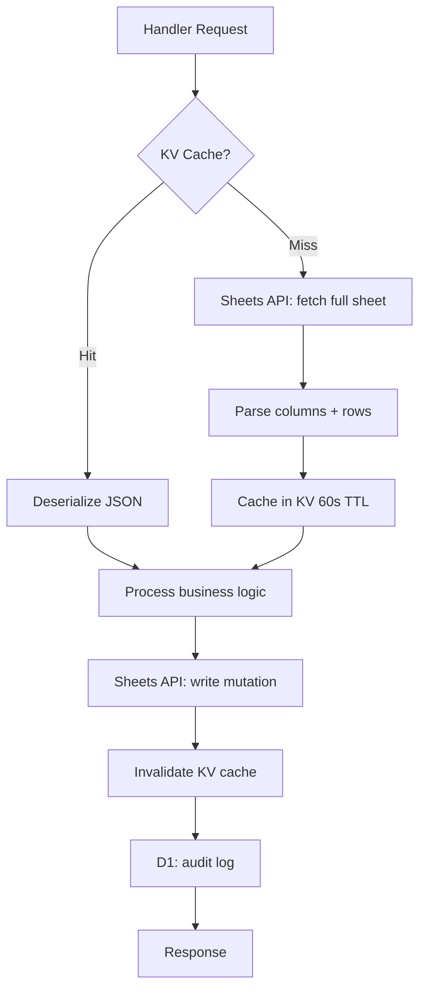
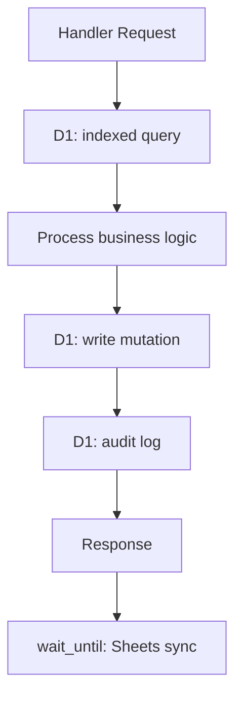

# D1 Migration Architecture — Google Sheets → D1 Primary Data Store

> **Current Status**: **Phase 2a+ LIVE** — D1 binding exists in `wrangler.toml`, `worker/src/db.rs` module is active, handlers use D1 for claim locks and audit queries. The system is past Phase 2a (schema + dual-write).

> Companion to Issue #046. Covers data models, schema design, current-state analysis,
> target-state architecture, and the phased migration plan.

## Table of Contents

1. [Current Architecture](#current-architecture)
2. [Target Architecture](#target-architecture)
3. [Data Flow Comparison](#data-flow-comparison)
4. [Schema Design](#schema-design)
5. [Files Changed](#files-changed)
6. [Query Patterns](#query-patterns)
7. [Sheets Sync Protocol](#sheets-sync-protocol)
8. [Seed Strategy](#seed-strategy)

---

## Current Architecture

### Storage Map

```
┌─────────────────────────────────────────────────────────────────┐
│                    CURRENT STATE (Post Phase 2)                  │
├─────────────────────────────────────────────────────────────────┤
│                                                                  │
│  D1 (PRIMARY SOURCE OF TRUTH)                                   │
│  ├── claim_locks (Phase 1)                                      │
│  ├── audit_log (Phase 1)                                        │
│  ├── attendees (Phase 2 — replaces Attendees sheet)             │
│  ├── contacts (Phase 2 — replaces Contacts sheet)               │
│  ├── events (Phase 2 — replaces KV + Events tab)                │
│  ├── staff (Phase 2 — replaces Staff sheet)                     │
│  ├── developer_profiles (Phase 2)                               │
│  ├── registration_responses (Phase 2)                           │
│  ├── quiz_configs (Phase 2 — replaces KV quiz questions)        │
│  ├── quiz_progress (Phase 2 — replaces KV quiz progress)        │
│  ├── escrow_index (Phase 2 — replaces KV escrow mapping)        │
│  ├── campaigns (Phase 2)                                        │
│  ├── campaign_events (Phase 2)                                  │
│  └── developer_campaign_progress (Phase 2)                      │
│                                                                  │
│  Google Sheets (ASYNC REPORTING LAYER)                          │
│  ├── Attendees sheet (synced from D1 via wait_until)            │
│  ├── Staff sheet (synced from D1 via wait_until)                │
│  ├── Contacts sheet (synced from D1 via wait_until)             │
│  └── Events tab (synced from D1 via wait_until)                 │
│                                                                  │
│  KV — EVENTS namespace (c8a6a87f...)                            │
│  ├── DUAL-WRITE mirror of D1 (for read compat during migrate)  │
│  │   ├── "events" → EventIndex JSON                            │
│  │   ├── "event:{id}" → EventConfig JSON                       │
│  │   └── "event:{id}:audit" → audit JSON array                 │
│  ├── KV-ONLY (not yet migrated — Issue #053):                  │
│  │   ├── event:{id}:adventure:config          → AdventureConfig │
│  │   ├── event:{id}:adventure:progress:{tok}  → AdventureProg   │
│  │   ├── event:{id}:onchain                   → Vec<OnChainEvt> │
│  │   ├── onchain:sig:{sig}                    → dedup (90d TTL) │
│  │   ├── onchain:cursor:{addr}                → polling cursor  │
│  │   ├── thb_deposit:{eid}:{email}            → ThbDeposit      │
│  │   ├── thb_deposits:{eid}                   → Vec<ThbDeposit> │
│  │   ├── deposit_status:{id}                  → DepositStatus   │
│  │   ├── org:{org_id}                         → OrgConfig       │
│  │   ├── orgs                                 → OrgIndex        │
│  │   ├── event:{id}:form:config              → form JSON       │
│  │   └── jwt_blacklist:{hash}                 → "1" (TTL=exp)   │
│  └── TTL caches:                                                │
│      └── google_token → OAuth token (3500s TTL)                 │
│                                                                  │
│  KV — QUIZ namespace (REMOVED from wrangler.toml)               │
│                                                                  │
│  R2 (BLOB STORAGE)                                              │
│  └── badges, slips, refund proofs                               │
└─────────────────────────────────────────────────────────────────┘
```

### Hot Path Latency (Check-in)

```
POST /api/checkin/:id
  │
  ├─ 1. KV cache lookup for attendee list
  │     Miss → Sheets API fetch (300ms) + column mapping (200ms)
  │     Hit → JSON deserialize (~10ms)
  │
  ├─ 2. Sheets API write (mark_checked_in)
  │     ~200ms — UPDATE 3 columns (timestamp, staff, claim_token)
  │
  ├─ 3. KV cache invalidation
  │     3 DELETE calls (~5ms each, but KV eventual consistency)
  │
  ├─ 4. Sheets API write (contact upsert)
  │     ~250ms — find row + update (2 sequential API calls)
  │
  └─ 5. D1 write (audit log)
        ~5ms

Total: 500-800ms (cache miss) / 200-300ms (cache hit)
```

### Sheets Module Dependency Map

```
sheets/mod.rs
├── get_attendees()          ← checkin, claim, attendee, deposit, qr, register
│   └── get_column_mapping() ← resolves dynamic column headers
├── get_claim_map_cached()   ← claim (hot path)
├── get_attendee_by_id()     ← checkin, attendee
├── get_attendee_by_claim_token() ← claim
├── get_staff_members()      ← auth middleware
└── get_cached_access_token() ← all Sheets operations

sheets/write.rs
├── mark_checked_in()        ← checkin handler
├── mark_virtual_checked_in()← checkin handler
├── clear_checked_in()       ← undo checkin handler
├── mark_claimed()           ← claim handler
├── append_attendee_row()    ← register handler
├── append_walkin_row()      ← walkin handler
├── update_participation_type() ← attendee handler
├── write_bank_info()        ← deposit handler
├── write_deposit_verification() ← deposit handler
├── update_deposit_method()  ← deposit handler
├── write_refund_status()    ← deposit handler
└── write_refund_link()      ← deposit handler

sheets/contacts.rs
├── upsert_contact()         ← register, walkin, deposit handlers
├── list_contacts()          ← contacts handler
├── increment_credit()       ← deposit handler
└── get_credit_balance()     ← deposit handler

sheets/events_tab.rs
├── upsert_event_tab()       ← events handler
├── list_events_tab()        ← contacts handler
└── delete_event_tab()       ← events handler
```

---

## Target Architecture

```
┌─────────────────────────────────────────────────────────────────┐
│                    TARGET STATE (Post Phase 3 — Issue #053)     │
├─────────────────────────────────────────────────────────────────┤
│                                                                  │
│  D1 (PRIMARY SOURCE OF TRUTH — ALL BUSINESS DATA)               │
│  ├── Phase 1: claim_locks, audit_log                             │
│  ├── Phase 2: attendees, contacts, events, staff, developers,   │
│  │            registration_responses, quiz_configs, quiz_progress│
│  │            escrow_index, campaigns, campaign_events,          │
│  │            developer_campaign_progress                        │
│  └── Phase 3: adventure_configs, adventure_progress,             │
│               onchain_events, onchain_dedup, onchain_cursors,    │
│               thb_deposits, deposit_status,                      │
│               organizations, event_form_config                   │
│       │                                                          │
│       │ D1 binding: sub-ms indexed queries                       │
│       │                                                          │
│  Handlers (direct D1 reads + writes)                            │
│       │                                                          │
│       ▼ async sync via wait_until()                             │
│  Google Sheets (REPORTING / BACKUP)                             │
│  └── Mirrors D1 data for non-technical organizers               │
│                                                                  │
│  KV (TEMPORARY / TTL-BASED ONLY)                                │
│  ├── google_token → OAuth token (3500s TTL)                     │
│  └── jwt_blacklist:{hash} → "1" (TTL=exp — keeps auto-cleanup)   │
│                                                                  │
│  R2 (BLOB STORAGE — unchanged)                                   │
│  └── badges, slips, refund proofs                               │
└─────────────────────────────────────────────────────────────────┘
```

### Hot Path Latency After Migration (Check-in)

```
POST /api/checkin/:id
  │
  ├─ 1. D1 query: SELECT * FROM attendees WHERE id = ?1
  │     ~3ms (indexed primary key)
  │
  ├─ 2. D1 write: UPDATE attendees SET checked_in_at=?, checked_in_by=?, claim_token=?
  │     ~5ms (indexed update)
  │
  ├─ 3. D1 write: INSERT INTO audit_log
  │     ~5ms
  │
  └─ 4. Async: wait_until() → Sheets write (200ms, non-blocking)

Total: ~13ms (blocking) + async Sheets sync
```

---

## Data Flow Comparison

### Before (Sheets-First)



### After (D1-First)



---

## Schema Design

### Migration File: `0002_attendees_contacts_events.sql`

```sql
-- Issue #046: D1 Phase 2 — Attendees, Contacts, Events, Staff
-- Idempotent: uses IF NOT EXISTS for safe re-runs.

-- ============================================================
-- ATTENDEES
-- Replaces: Attendees Google Sheet (per-event)
-- Mapped from: sheets/mod.rs → get_attendees() → Attendee struct
-- ============================================================

CREATE TABLE IF NOT EXISTS attendees (
    id                  TEXT PRIMARY KEY,              -- api_id (UUID from Sheets row)
    event_id            TEXT NOT NULL,                 -- FK → events.id
    email               TEXT NOT NULL,
    name                TEXT NOT NULL DEFAULT '',
    approval_status     TEXT NOT NULL DEFAULT 'approved',
                                                      -- approved | pending | rejected | waitlist | cancelled
    participation_type  TEXT NOT NULL DEFAULT 'in_person',
                                                      -- in_person | online
    -- Check-in fields (NULL until checked in)
    checked_in_at       TEXT,                          -- ISO 8601 timestamp
    checked_in_by       TEXT,                          -- staff email who checked them in
    claim_token         TEXT UNIQUE,                   -- UUID v7, generated at check-in
    -- Claim/NFT fields (NULL until NFT claimed)
    claimed_at          TEXT,                          -- ISO 8601 timestamp
    claim_asset_id      TEXT,                          -- compressed NFT asset ID
    claim_signature     TEXT,                          -- transaction signature
    -- QR code
    qr_url              TEXT,                          -- generated QR URL for check-in
    -- Contact preferences
    contact_channel     TEXT NOT NULL DEFAULT '',      -- Telegram | Discord | etc.
    contact_handle      TEXT NOT NULL DEFAULT '',
    -- Deposit fields
    deposit_status      TEXT NOT NULL DEFAULT 'none',  -- none | pending_deposit | deposited | pending_verification
                                                      -- verified | refunded | credit | forfeited
    deposit_amount_usdc INTEGER NOT NULL DEFAULT 0,    -- USDC with 6 decimals
    deposit_amount_thb  INTEGER NOT NULL DEFAULT 0,    -- THB in satang (no decimals)
    deposit_tx_hash     TEXT,                          -- Solana transaction signature
    deposit_slip_r2_key TEXT,                          -- R2 object key for slip image
    deposit_verified_at TEXT,
    deposit_verified_by TEXT,
    -- Refund fields
    refund_tx_hash      TEXT,
    refund_marked_at    TEXT,
    refund_marked_by    TEXT,
    refund_link         TEXT,
    -- Bank info (for THB refund)
    bank_name           TEXT,
    bank_account_number TEXT,
    bank_account_name   TEXT,
    -- Metadata
    created_at          TEXT NOT NULL DEFAULT (datetime('now')),
    updated_at          TEXT NOT NULL DEFAULT (datetime('now')),
    -- Sync tracking (for Sheets reconciliation)
    sheet_row_index     INTEGER,                       -- 1-based row in Google Sheet
    synced_at           TEXT                           -- last successful Sheets sync
);

CREATE INDEX IF NOT EXISTS idx_attendees_event       ON attendees(event_id);
CREATE INDEX IF NOT EXISTS idx_attendees_email       ON attendees(email);
CREATE INDEX IF NOT EXISTS idx_attendees_claim_token ON attendees(claim_token) WHERE claim_token IS NOT NULL;
CREATE INDEX IF NOT EXISTS idx_attendees_approval    ON attendees(event_id, approval_status);
CREATE INDEX IF NOT EXISTS idx_attendees_deposit     ON attendees(event_id, deposit_status) WHERE deposit_status != 'none';

-- ============================================================
-- CONTACTS
-- Replaces: Contacts Google Sheet (master, per-org)
-- Mapped from: sheets/contacts.rs → Contact struct
-- ============================================================

CREATE TABLE IF NOT EXISTS contacts (
    email                TEXT PRIMARY KEY,             -- lowercased email
    name                 TEXT NOT NULL DEFAULT '',
    first_registered     TEXT NOT NULL DEFAULT (datetime('now')),
    last_registered      TEXT NOT NULL DEFAULT (datetime('now')),
    events_joined        TEXT NOT NULL DEFAULT '',     -- comma-separated event IDs
    event_count          INTEGER NOT NULL DEFAULT 0,
    contact_channel      TEXT NOT NULL DEFAULT '',
    contact_handle       TEXT NOT NULL DEFAULT '',
    -- Deposit credit (rolling balance across events)
    deposit_credit_thb   INTEGER NOT NULL DEFAULT 0,
    deposit_credit_usdc  INTEGER NOT NULL DEFAULT 0,
    deposit_credit_since TEXT,
    -- Sync tracking
    synced_at            TEXT
);

CREATE INDEX IF NOT EXISTS idx_contacts_events ON contacts(events_joined);

-- ============================================================
-- EVENTS
-- Replaces: KV event:{id} + Events tab in Google Sheets
-- Mapped from: event_store/schema.rs → EventConfig struct
-- ============================================================

CREATE TABLE IF NOT EXISTS events (
    id                   TEXT PRIMARY KEY,             -- slug-based (e.g. solana-bangkok-2025)
    name                 TEXT NOT NULL,
    slug                 TEXT NOT NULL,
    status               TEXT NOT NULL DEFAULT 'draft',
                                                      -- draft | active | completed | archived
    event_format         TEXT NOT NULL DEFAULT 'in_person',
                                                      -- in_person | online | hybrid
    event_start_ms       INTEGER NOT NULL,             -- epoch milliseconds
    event_end_ms         INTEGER NOT NULL,
    -- Deposit config
    deposit_enabled      INTEGER NOT NULL DEFAULT 0,   -- boolean as 0/1
    deposit_amount_usdc  INTEGER NOT NULL DEFAULT 0,
    deposit_amount_thb   INTEGER NOT NULL DEFAULT 0,
    -- Escrow config
    escrow_status        TEXT NOT NULL DEFAULT 'none',
                                                      -- none | initialized | deactivated | closed
    escrow_pda           TEXT,                          -- on-chain escrow PDA address
    -- Event details
    location             TEXT NOT NULL DEFAULT '',
    tagline              TEXT NOT NULL DEFAULT '',
    organizer_emails     TEXT NOT NULL DEFAULT '',      -- comma-separated
    organization_id      TEXT NOT NULL DEFAULT '',      -- FK → org:{org_id} in KV
    video_url            TEXT NOT NULL DEFAULT '',
    -- Google Sheets linkage (for async sync)
    sheet_id             TEXT NOT NULL DEFAULT '',
    sheet_name           TEXT NOT NULL DEFAULT 'Attendees',
    staff_sheet_name     TEXT NOT NULL DEFAULT 'staff',
    -- Metadata
    capacity             INTEGER NOT NULL DEFAULT 0,    -- 0 = unlimited
    total_attendees      INTEGER NOT NULL DEFAULT 0,    -- denormalized count
    created_at           TEXT NOT NULL DEFAULT (datetime('now')),
    updated_at           TEXT NOT NULL DEFAULT (datetime('now'))
);

CREATE INDEX IF NOT EXISTS idx_events_status ON events(status);
CREATE INDEX IF NOT EXISTS idx_events_org   ON events(organization_id);
CREATE INDEX IF NOT EXISTS idx_events_slug  ON events(slug);

-- ============================================================
-- STAFF
-- Replaces: Staff sheet in Google Sheets
-- Mapped from: sheets/mod.rs → StaffMember struct
-- ============================================================

CREATE TABLE IF NOT EXISTS staff (
    email    TEXT NOT NULL,                             -- staff email (lowercased)
    event_id TEXT NOT NULL,                             -- event they're staff for
    role     TEXT NOT NULL DEFAULT 'staff',             -- staff | organizer | admin
    name     TEXT NOT NULL DEFAULT '',
    PRIMARY KEY (email, event_id)
);

CREATE INDEX IF NOT EXISTS idx_staff_event ON staff(event_id);
```

### Column Mapping: Sheets ↔ D1

| Attendee Column (Sheets) | D1 Column | Notes |
|--------------------------|-----------|-------|
| A (row number) | `id` | UUID generated, not row-based |
| B (name) | `name` | Direct |
| C (email) | `email` | Lowercased |
| D (approval_status) | `approval_status` | Direct |
| E (participation_type) | `participation_type` | Direct |
| F (registered_at) | `created_at` | Renamed |
| G (contact_channel) | `contact_channel` | Direct |
| H (contact_handle) | `contact_handle` | Direct |
| I (checked_in_at) | `checked_in_at` | Direct |
| J (checked_in_by) | `checked_in_by` | Direct |
| K (deposit_status) | `deposit_status` | Direct |
| L (claim_token) | `claim_token` | Direct — now UNIQUE constraint |
| M (claimed_at) | `claimed_at` | Direct |

---

## Files Changed

### Phase 2a: Schema + Dual-Write

| File | Action | Description |
|------|--------|-------------|
| `worker/migrations/0002_attendees_contacts_events.sql` | **NEW** | Schema migration |
| `worker/src/db.rs` | **MODIFY** | Add query functions for all 4 new tables |
| `worker/src/sheets/write.rs` | **MODIFY** | Add D1 writes after each Sheets write |
| `worker/src/sheets/contacts.rs` | **MODIFY** | Add D1 contact upsert alongside Sheets |
| `worker/src/sheets/events_tab.rs` | **MODIFY** | Add D1 event upsert alongside Sheets |

### Phase 2b: D1-First Reads

| File | Action | Description |
|------|--------|-------------|
| `worker/src/sheets/mod.rs` | **MODIFY** | `get_attendees()` → D1 query, Sheets fallback |
| `worker/src/sheets/mod.rs` | **MODIFY** | `get_claim_map_cached()` → D1 query |
| `worker/src/sheets/mod.rs` | **MODIFY** | `get_staff_members()` → D1 query |
| `worker/src/handlers/checkin.rs` | **MODIFY** | Direct D1 attendee lookup |
| `worker/src/handlers/claim.rs` | **MODIFY** | Direct D1 claim token query |
| `worker/src/handlers/attendee.rs` | **MODIFY** | D1-backed listing |
| `worker/src/handlers/events.rs` | **MODIFY** | D1-backed event CRUD |
| `worker/src/handlers/contacts.rs` | **MODIFY** | D1-backed contact listing |

### Phase 2c: Sheets Async-Only

| File | Action | Description |
|------|--------|-------------|
| `worker/src/sheets/write.rs` | **MODIFY** | Wrap Sheets calls in `wait_until()` |
| `worker/src/sheets/contacts.rs` | **MODIFY** | Wrap Sheets calls in `wait_until()` |
| `worker/src/sheets/events_tab.rs` | **MODIFY** | Wrap Sheets calls in `wait_until()` |

### Phase 2d: Remove KV Attendee Caching

| File | Action | Description |
|------|--------|-------------|
| `worker/src/sheets/mod.rs` | **MODIFY** | Remove attendee/claim_map KV cache logic |
| Various handlers | **MODIFY** | Remove KV cache invalidation calls |

### Unchanged

| File | Reason |
|------|--------|
| `worker/src/state.rs` | D1 binding already present |
| `worker/wrangler.toml` | D1 binding already configured |
| `worker/src/event_store/` | Phase 2b migrates reads; store remains as write abstraction |
| `worker/src/org_store.rs` | Organizations stay in KV |
| `worker/src/quiz.rs` | Stays in KV |
| `worker/src/adventure.rs` | Stays in KV |
| `domain/` | No changes — shared types work with both Sheets and D1 |
| `frontend-leptos/` | No changes — API surface unchanged |

---

## Query Patterns

### Hot Path Queries (must be < 10ms)

```sql
-- Check-in: lookup attendee by ID
SELECT * FROM attendees WHERE id = ?1 AND event_id = ?2;

-- Check-in: write check-in data
UPDATE attendees
SET checked_in_at = ?1, checked_in_by = ?2, claim_token = ?3, updated_at = datetime('now')
WHERE id = ?4;

-- Claim: lookup by claim token
SELECT * FROM attendees WHERE claim_token = ?1;

-- Claim: write claim result
UPDATE attendees
SET claimed_at = ?1, claim_asset_id = ?2, claim_signature = ?3, updated_at = datetime('now')
WHERE claim_token = ?4;

-- Undo check-in
UPDATE attendees
SET checked_in_at = NULL, checked_in_by = NULL, claim_token = NULL, updated_at = datetime('now')
WHERE id = ?1;
```

### List Queries (must be < 50ms)

```sql
-- Attendee list for event (with filters)
SELECT * FROM attendees WHERE event_id = ?1 ORDER BY name LIMIT ?2 OFFSET ?3;
SELECT * FROM attendees WHERE event_id = ?1 AND approval_status = 'approved';

-- Contact list
SELECT * FROM contacts ORDER BY last_registered DESC LIMIT ?1;

-- Staff for event
SELECT * FROM staff WHERE event_id = ?1;

-- Event list
SELECT * FROM events WHERE status != 'archived' ORDER BY event_start_ms DESC;

-- Deposit queue
SELECT * FROM attendees WHERE event_id = ?1 AND deposit_status = 'verified'
  AND refund_tx_hash IS NULL;
```

### Write Queries (dual-write in Phase 2a)

```sql
-- Registration: insert attendee
INSERT INTO attendees (id, event_id, email, name, approval_status, participation_type, contact_channel, contact_handle)
VALUES (?1, ?2, ?3, ?4, ?5, ?6, ?7, ?8)
ON CONFLICT (id) DO UPDATE SET
  name = excluded.name,
  updated_at = datetime('now');

-- Registration: upsert contact
INSERT INTO contacts (email, name, first_registered, last_registered, events_joined, event_count)
VALUES (?1, ?2, datetime('now'), datetime('now'), ?3, 1)
ON CONFLICT (email) DO UPDATE SET
  name = excluded.name,
  last_registered = datetime('now'),
  events_joined = ?4,
  event_count = ?5;

-- Event CRUD
INSERT INTO events (id, name, slug, status, ...) VALUES (...);
UPDATE events SET name = ?1, updated_at = datetime('now') WHERE id = ?2;
UPDATE events SET status = 'archived', updated_at = datetime('now') WHERE id = ?1;
```

---

## Sheets Sync Protocol

After Phase 2c, Sheets writes happen asynchronously via `wait_until()`.

### Sync Contract

| Property | Guarantee |
|----------|-----------|
| Ordering | Writes to D1 are synchronous; Sheets sync is best-effort, same order |
| Reliability | D1 write failure → handler returns error; Sheets write failure → logged, retried next time |
| Latency | D1: < 10ms; Sheets: < 5s (async, non-blocking) |
| Consistency | D1 is source of truth; Sheets eventually consistent |

### Sync Implementation Pattern

```rust
// Phase 2c pattern — handler returns immediately, Sheets syncs async
pub async fn check_in(...) -> Result<...> {
    // 1. D1 read (fast)
    let attendee = db::get_attendee(&d1, &id, &event_id).await?;

    // 2. D1 write (fast, source of truth)
    db::mark_checked_in(&d1, &id, &claim_token, &staff_email).await?;

    // 3. Async Sheets sync (non-blocking)
    if let Some(ctx) = &state.worker_ctx {
        let state = state.clone();
        ctx.wait_until(async move {
            if let Err(e) = sheets::mark_checked_in(...).await {
                tracing::warn!(error = %e, "sheets sync failed (non-fatal)");
            }
        });
    }

    // 4. Return immediately
    Ok(response)
}
```

### Reconciliation

A reconciliation endpoint (`GET /api/admin/reconcile?event_id=xxx`) should:
1. Read all attendees from D1 for the event
2. Read all attendees from Sheets for the event
3. Compare by `email` + `event_id`
4. Report mismatches (D1-only, Sheets-only, field differences)
5. Optionally force-sync D1 → Sheets

---

## Seed Strategy

### One-Time Data Import (Before Phase 2b)

```bash
# Step 1: Create seed script
cat > worker/scripts/seed_d1_from_sheets.ts << 'EOF'
// Reads from Google Sheets API, writes to D1 via Wrangler
// 1. List events from KV
// 2. For each event, fetch attendees from Sheets
// 3. For each attendee, INSERT INTO attendees
// 4. Fetch contacts from master sheet
// 5. For each contact, INSERT INTO contacts
// 6. Fetch staff from staff sheets
// 7. For each staff, INSERT INTO staff
EOF

# Step 2: Run seed
npx wrangler d1 execute bethere-db --local --file=worker/migrations/0002_attendees_contacts_events.sql
npx tsx worker/scripts/seed_d1_from_sheets.ts

# Step 3: Verify counts
npx wrangler d1 execute bethere-db --local --command="SELECT event_id, COUNT(*) FROM attendees GROUP BY event_id"
npx wrangler d1 execute bethere-db --local --command="SELECT COUNT(*) FROM contacts"
npx wrangler d1 execute bethere-db --local --command="SELECT event_id, COUNT(*) FROM staff GROUP BY event_id"

# Step 4: Run against production (after validation)
npx wrangler d1 execute bethere-db --remote --file=worker/migrations/0002_attendees_contacts_events.sql
```

### Validation Checklist

- [ ] Attendee count in D1 matches Sheets count per event
- [ ] All claim tokens in D1 match Sheets
- [ ] All checked-in statuses match
- [ ] Contact count matches master sheet
- [ ] Staff list matches per-event staff sheets
- [ ] No duplicate emails in contacts
- [ ] No orphaned attendees (all have valid event_id)
