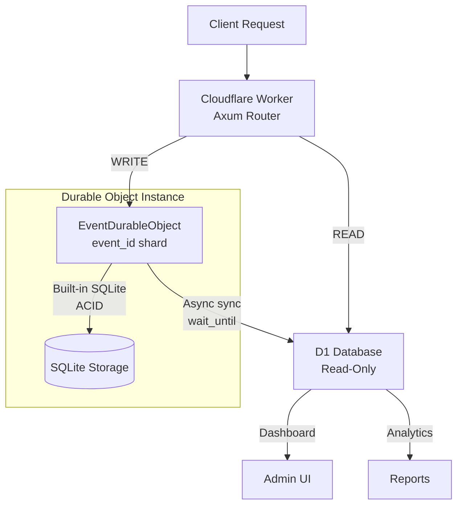

# Durable Objects Architecture — ACID Writes for BeThere

> Status: **Planning** — Issue #050
> Related: `docs/d1_migration_architecture.md`, `.issues/050_durable_objects_acid_migration.md`
> CTO decision: "ใช้ผ่าน durable objects จะได้ acid"

## Table of Contents

1. [Overview](#overview)
2. [Why Durable Objects](#why-durable-objects)
3. [Architecture Diagram](#architecture-diagram)
4. [Data Flow](#data-flow)
5. [DO Class Design](#do-class-design)
6. [Schema](#schema)
7. [Sync Protocol (DO → D1)](#sync-protocol-do--d1)
8. [Write Path Routing](#write-path-routing)
9. [Read Path](#read-path)
10. [Configuration](#configuration)
11. [Testing Strategy](#testing-strategy)
12. [Migration from D1-Only](#migration-from-d1-only)

## Overview

BeThere currently uses D1 as its primary data store. While D1 provides excellent read performance and familiar SQL, it lacks strict ACID guarantees — reads are eventually consistent across replicas, and write operations are only near-atomic.

This document describes the migration to a **hybrid architecture**:

- **Durable Objects + SQLite** → ACID-critical writes (check-in, claim, registration, deposit)
- **D1** → Read-only queries (dashboard, analytics, attendee lists)

### Decision History

| Date | Decision | Driver |
|------|----------|--------|
| 2025-Q1 | D1 over DO for Phase 1 (claim locks + audit) | Simplicity, D1 sufficient for scale |
| 2025-Q2 | D1 as primary data store (Phase 2a-2c) | Latency improvement over Sheets |
| 2026-Q2 | DO + SQLite for ACID writes | CTO directive for ACID guarantees |

## Why Durable Objects

### ACID Comparison

| Property | D1 | Durable Objects + SQLite |
|----------|----|----|
| **Atomicity** | Near-atomic via `ON CONFLICT` | Truly atomic — single request processes at a time |
| **Consistency** | Eventually consistent across edge locations | Strongly consistent — single instance per event |
| **Isolation** | No isolation between concurrent requests | Full isolation — requests are serialized |
| **Durability** | Commits persisted, replicated async | Commits persisted synchronously |

### workers-rs Support

The `worker` crate (v0.8+) provides full Rust support for DO + SQLite:

```rust
use worker::{durable_object, DurableObject, State, Env, Result, Request, Response, SqlStorage};

#[durable_object]
pub struct EventDurableObject {
    sql: SqlStorage,
}

impl DurableObject for EventDurableObject {
    fn new(state: State, _env: Env) -> Self {
        let sql = state.storage().sql();
        sql.exec("CREATE TABLE IF NOT EXISTS counter(value INTEGER);", None)
            .expect("create table");
        Self { sql }
    }

    async fn fetch(&self, _req: Request) -> Result<Response> {
        // Single-threaded, ACID guaranteed
        Response::ok("ok")
    }
}
```

Source: https://github.com/cloudflare/workers-rs#durable-objects

## Architecture Diagram



## Data Flow

### Write Path (ACID)

```
1. Client sends POST /api/checkin
2. Worker resolves event_id from request
3. Worker gets DO stub: env.EVENT_DO.id_from_name(event_id).get_stub()
4. Worker sends request to DO stub via fetch()
5. DO processes request single-threaded:
   a. Begin SQLite transaction
   b. UPDATE attendees SET checked_in_at = ... WHERE id = ?
   c. Commit
6. DO responds to Worker with result
7. Worker triggers async D1 sync via wait_until()
8. Worker responds to client
```

### Read Path (D1)

```
1. Client sends GET /api/attendees
2. Worker queries D1 directly:
   SELECT * FROM attendees WHERE event_id = ? ORDER BY sheet_row_index
3. D1 responds (sub-ms for indexed queries)
4. Worker responds to client
```

### Read-After-Write Consistency

For flows that need to read their own write (e.g., check-in then immediately query):

- Option A: Accept eventual consistency (D1 sync completes within ~100ms)
- Option B: Read from DO directly for the specific attendee
- Recommendation: Option A — the UI can refresh after a short delay

## DO Class Design

### EventDurableObject

The single DO class, sharded by `event_id`. Each event gets its own DO instance with its own SQLite database.

```rust
// worker/src/durable_objects/event_do.rs

use worker::{durable_object, DurableObject, State, Env, Result, Request, Response, SqlStorage};
use serde::{Deserialize, Serialize};

#[durable_object]
pub struct EventDurableObject {
    sql: SqlStorage,
    env: Env,
}

// RPC request types — Worker sends these as JSON in the fetch body
#[derive(Deserialize)]
#[serde(tag = "action")]
enum DoRequest {
    #[serde(rename = "check_in")]
    CheckIn {
        attendee_id: String,
        checked_in_at: String,
        checked_in_by: String,
        claim_token: String,
    },
    #[serde(rename = "acquire_claim_lock")]
    AcquireClaimLock {
        lock_id: String,
        event_id: String,
        token: String,
        wallet: String,
        expires_at: String,
    },
    #[serde(rename = "finalize_claim_lock")]
    FinalizeClaimLock {
        event_id: String,
        token: String,
        asset_id: String,
        signature: String,
        claimed_at: String,
    },
    #[serde(rename = "release_claim_lock")]
    ReleaseClaimLock {
        event_id: String,
        token: String,
    },
    #[serde(rename = "claim_attendee")]
    ClaimAttendee {
        claim_token: String,
        claimed_at: String,
        claim_asset_id: String,
        claim_signature: String,
    },
    #[serde(rename = "upsert_attendee")]
    UpsertAttendee {
        id: String,
        event_id: String,
        email: String,
        name: String,
        approval_status: String,
        participation_type: String,
        contact_channel: String,
        contact_handle: String,
    },
    #[serde(rename = "verify_deposit")]
    VerifyDeposit {
        id: String,
        deposit_status: String,
        deposit_tx_hash: String,
        deposit_amount_usdc: i64,
        verified_at: String,
        verified_by: String,
    },
    #[serde(rename = "mark_refund")]
    MarkRefund {
        id: String,
        deposit_status: String,
        refund_tx_hash: String,
        refund_marked_at: String,
        refund_marked_by: String,
    },
    #[serde(rename = "undo_check_in")]
    UndoCheckIn {
        id: String,
    },
}

#[derive(Serialize)]
struct DoResponse {
    success: bool,
    error: Option<String>,
}

impl DurableObject for EventDurableObject {
    fn new(state: State, env: Env) -> Self {
        let sql = state.storage().sql();
        // Initialize schema
        init_schema(&sql);
        Self { sql, env }
    }

    async fn fetch(&self, req: Request) -> Result<Response> {
        let body: DoRequest = req.json().await?;
        let result = match body {
            DoRequest::CheckIn { .. } => self.handle_check_in(&body),
            DoRequest::AcquireClaimLock { .. } => self.handle_acquire_lock(&body),
            // ... other handlers
        };
        Response::from_json(&result)
    }
}
```

### Schema Initialization

```rust
fn init_schema(sql: &SqlStorage) {
    // Attendees table
    sql.exec(
        "CREATE TABLE IF NOT EXISTS attendees (
            id TEXT PRIMARY KEY,
            event_id TEXT NOT NULL,
            email TEXT NOT NULL,
            name TEXT NOT NULL DEFAULT '',
            approval_status TEXT NOT NULL DEFAULT 'approved',
            participation_type TEXT NOT NULL DEFAULT 'in_person',
            checked_in_at TEXT,
            checked_in_by TEXT,
            claim_token TEXT UNIQUE,
            claimed_at TEXT,
            claim_asset_id TEXT,
            claim_signature TEXT,
            qr_url TEXT,
            contact_channel TEXT NOT NULL DEFAULT '',
            contact_handle TEXT NOT NULL DEFAULT '',
            deposit_status TEXT NOT NULL DEFAULT 'none',
            deposit_amount_usdc INTEGER NOT NULL DEFAULT 0,
            deposit_amount_thb INTEGER NOT NULL DEFAULT 0,
            deposit_tx_hash TEXT,
            deposit_slip_r2_key TEXT,
            deposit_verified_at TEXT,
            deposit_verified_by TEXT,
            refund_tx_hash TEXT,
            refund_marked_at TEXT,
            refund_marked_by TEXT,
            refund_link TEXT,
            bank_name TEXT,
            bank_account_number TEXT,
            bank_account_name TEXT,
            created_at TEXT NOT NULL DEFAULT (datetime('now')),
            updated_at TEXT NOT NULL DEFAULT (datetime('now')),
            sheet_row_index INTEGER,
            synced_at TEXT
        )",
        None,
    ).expect("create attendees table");

    sql.exec(
        "CREATE INDEX IF NOT EXISTS idx_attendees_email ON attendees(email)",
        None,
    ).expect("create attendees email index");

    sql.exec(
        "CREATE INDEX IF NOT EXISTS idx_attendees_claim_token ON attendees(claim_token) WHERE claim_token IS NOT NULL",
        None,
    ).expect("create attendees claim_token index");

    // Claim locks table
    sql.exec(
        "CREATE TABLE IF NOT EXISTS claim_locks (
            event_id TEXT NOT NULL,
            token TEXT NOT NULL,
            lock_id TEXT NOT NULL,
            wallet TEXT NOT NULL,
            started_at TEXT NOT NULL DEFAULT (datetime('now')),
            asset_id TEXT,
            signature TEXT,
            claimed_at TEXT,
            expires_at TEXT NOT NULL,
            PRIMARY KEY (event_id, token)
        )",
        None,
    ).expect("create claim_locks table");

    sql.exec(
        "CREATE INDEX IF NOT EXISTS idx_claim_locks_expires ON claim_locks(expires_at)",
        None,
    ).expect("create claim_locks expires index");

    // Staff table
    sql.exec(
        "CREATE TABLE IF NOT EXISTS staff (
            email TEXT NOT NULL,
            event_id TEXT NOT NULL,
            role TEXT NOT NULL DEFAULT 'staff',
            name TEXT NOT NULL DEFAULT '',
            PRIMARY KEY (email, event_id)
        )",
        None,
    ).expect("create staff table");
}
```

## Schema

The DO SQLite schema is a subset of the D1 schema — only event-scoped tables that need ACID guarantees.

### What's in DO SQLite

| Table | Purpose | Why ACID needed |
|-------|---------|-----------------|
| `attendees` | Per-event attendee data | Check-in/claim race prevention |
| `claim_locks` | NFT claim dedup | Atomic lock acquisition |
| `staff` | Per-event staff roles | Write integrity |

### What's in D1 Only

| Table | Purpose | Why NOT in DO |
|-------|---------|---------------|
| `audit_log` | Append-only audit trail | No contention, appends are safe |
| `contacts` | Cross-event contacts | Cross-event scope, not event-scoped |
| `developer_profiles` | Developer CRM | Low contention |
| `registration_responses` | Form answers | Write-once, no contention |
| `events` | Event config | Read-heavy, infrequent writes |

### Schema Compatibility

Both DO SQLite and D1 use the same SQL dialect (SQLite). The schemas are identical where tables overlap, ensuring:
- Same queries work in both stores
- Easy sync between DO → D1
- No data transformation needed

## Sync Protocol (DO → D1)

After every write to DO SQLite, the changed row must be synced to D1 for read availability.

### Sync Strategy

```
DO write succeeds
    │
    ├─ Return success to caller immediately
    │
    └─ wait_until() → async sync to D1
         │
         ├─ Success → D1 has latest data
         │
         └─ Failure → D1 is stale; DO is source of truth
              │
              └─ Next DO write will re-sync (idempotent upsert)
```

### Sync Implementation Pattern

```rust
// After a successful DO write, trigger async D1 sync
fn sync_attendee_to_d1(&self, attendee_id: &str) {
    // Read the updated row from DO SQLite
    let row = self.sql.exec(
        "SELECT * FROM attendees WHERE id = ?",
        vec![attendee_id.into()],
    );

    // Upsert to D1 (idempotent)
    if let Some(d1) = self.env.d1("DB").ok() {
        // fire-and-forget via wait_until
        // d1.prepare("INSERT INTO attendees ... ON CONFLICT(id) DO UPDATE ...").run()
    }
}
```

### Sync Guarantees

| Guarantee | Level |
|-----------|-------|
| DO → D1 eventual consistency | Within seconds (single async write) |
| Read-after-write from DO | Immediate (DO is source of truth) |
| Read-after-write from D1 | Eventual (~100ms) |
| DO crash before sync | Data survives in DO storage; D1 catches up on next access |
| D1 down during sync | DO continues serving; sync retries on next write |

## Write Path Routing

The Worker routes write operations to DO based on the operation type:

### Router Integration

```rust
// In the existing Axum router, handlers call DO for writes:

async fn handle_checkin(
    State(state): State<AppState>,
    Path(event_id): Path<String>,
    Json(payload): Json<CheckInRequest>,
) -> Result<Json<CheckInResponse>> {
    // 1. Route write through DO
    let namespace = state.env.durable_object("EVENT_DO")?;
    let stub = namespace.id_from_name(&event_id)?.get_stub()?;

    let do_request = DoRequest::CheckIn {
        attendee_id: payload.attendee_id,
        checked_in_at: utc_now(),
        checked_in_by: payload.staff_email,
        claim_token: generate_claim_token(),
    };

    let resp = stub.fetch_with_request(
        Request::new_with_init(
            "http://internal/do",
            &RequestInit {
                method: Method::Post,
                body: Some(serde_json::to_string(&do_request)?.into()),
                ..Default::default()
            },
        )?,
    ).await?;

    // 2. Parse result
    let result: DoResponse = resp.json().await?;
    if !result.success {
        return Err(/* ... */);
    }

    // 3. Respond to client (D1 sync happens in DO's wait_until)
    Ok(Json(CheckInResponse { success: true }))
}
```

## Read Path

Reads continue to query D1 directly — no change from current behavior:

```rust
async fn get_attendees(
    State(state): State<AppState>,
    Path(event_id): Path<String>,
) -> Result<Json<Vec<Attendee>>> {
    let d1 = state.d1.as_ref().ok_or("D1 not configured")?;
    let attendees = db::attendees::get_attendees_by_event(d1, &event_id).await?;
    Ok(Json(attendees))
}
```

## Configuration

### wrangler.toml

```toml
# Existing D1 binding (now read-only for attendee data)
[[d1_databases]]
binding = "DB"
database_name = "bethere-db"
database_id = "98d09542-e7d8-4413-ac34-4276a50d126c"
migrations_dir = "migrations"

# NEW: Durable Object binding for ACID writes
[[durable_objects.bindings]]
name = "EVENT_DO"
class_name = "EventDurableObject"

# NEW: Migration to create DO class with SQLite storage
[[migrations]]
tag = "v1"
new_sqlite_classes = ["EventDurableObject"]
```

### Cargo.toml

No changes needed — `worker` v0.8 already includes DO + SqlStorage support.

## Testing Strategy

### Unit Tests (LiteSVM-style for DO)

Test DO logic in isolation by mocking `SqlStorage`:

```rust
#[cfg(test)]
mod tests {
    use super::*;

    #[test]
    fn test_check_in_idempotent() {
        // Test that double check-in on same attendee is rejected
    }

    #[test]
    fn test_claim_lock_atomic() {
        // Test that concurrent lock acquisition only succeeds once
    }
}
```

### Integration Tests

Use `wrangler dev` with local DO + D1 for end-to-end testing:

```bash
npx wrangler dev --local --persist
# Run e2e tests against local DO + D1
```

### E2E Tests (Existing)

The existing Playwright e2e tests should pass unchanged — the API surface is identical, only the storage backend changes.

## Migration from D1-Only

### Phase-by-Phase Migration

| Phase | What | Risk |
|-------|------|------|
| **Phase 1** | DO skeleton + claim locks | Low — D1 claim locks remain as fallback |
| **Phase 2** | Check-in + claim writes through DO | Medium — hot path changes |
| **Phase 3** | Registration + deposit writes through DO | Medium — registration flow changes |
| **Phase 4** | Remove D1 write paths, harden sync | Low — just cleanup after validation |

### Rollback Strategy

Each phase is independently rollbackable. D1 write code is kept (not deleted) until Phase 4 is validated in production. To rollback:

1. Deploy previous version
2. Handler routes writes back to D1 directly
3. D1 is already in sync (sync was running during DO phase)

### What Doesn't Change

- API surface — same endpoints, same request/response shapes
- D1 read queries — `db/attendees.rs` read functions unchanged
- Frontend — no changes
- Domain crate — no changes

## Refs

- Issue #050: `.issues/050_durable_objects_acid_migration.md`
- Issue #037: `.issues/037_d1_database_migration.md`
- Issue #046: `.issues/046_d1_primary_data_store.md`
- D1 architecture: `docs/d1_migration_architecture.md`
- workers-rs DO docs: https://github.com/cloudflare/workers-rs#durable-objects
- Cloudflare DO getting started: https://developers.cloudflare.com/durable-objects/get-started/
- DO SQLite API: https://developers.cloudflare.com/durable-objects/api/storage/
