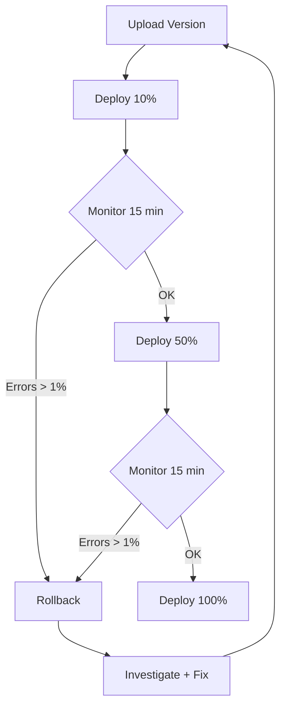

# Gradual Deployment Runbook — BeThere Worker

Safe mainnet rollout procedure using Wrangler's gradual deployment feature.

## Overview

Cloudflare Workers supports gradual (canary) deployments: ship to a percentage of traffic, monitor, then increase or rollback. This runbook covers the complete flow for deploying the BeThere worker to production with minimal risk.

## Prerequisites

- Wrangler 4.x installed (`npx wrangler --version`)
- Authenticated (`npx wrangler login`)
- Frontend built (`cd frontend-leptos && bash build.sh`)
- All tests passing:
  ```bash
  cargo test -p event-checkin-domain
  cargo test -p event-checkin-worker
  cd bethere-escrow && quasar test
  ```

## Deployment Flow



## Step 1: Upload Version (No Traffic)

Upload the new worker version without routing any traffic to it:

```bash
cd worker
npx wrangler versions upload
```

This uploads the WASM bundle and static assets but **does not change production traffic**. The version gets an ID you can reference later.

Save the version ID from the output:
```
✅ Uploaded version: <VERSION_ID>
```

## Step 2: Canary Deploy (10% Traffic)

Route 10% of traffic to the new version:

```bash
npx wrangler deployments create --version <VERSION_ID> --percentage 10
```

### What to Monitor (15 minutes)

| Metric | Check | Tool |
|--------|-------|------|
| Error rate | < 1% of requests return 5xx | `npx wrangler tail` |
| Startup time | < 50ms | Wrangler dashboard → Metrics |
| Escrow TX success | Deposits/refunds succeed | `wrangler tail` → filter for `/api/escrow/` |
| Asset serving | JS/CSS/WASM load correctly | `curl -I https://bethere.solana-thailand.workers.dev/event-checkin-frontend-*.js` |
| Health endpoint | `{"status":"ok"}` | `curl https://bethere.solana-thailand.workers.dev/api/health` |

### Monitoring Commands

```bash
# Real-time logs (watch for errors)
npx wrangler tail --format json

# Health check
curl -s https://bethere.solana-thailand.workers.dev/api/health | python3 -m json.tool

# Check assets are served
curl -s -o /dev/null -w "JS: %{http_code} (%{size_download} bytes)\n" \
  https://bethere.solana-thailand.workers.dev/event-checkin-frontend-41b6f7dcd92eacc4.js
```

## Step 3: Increase Traffic

If metrics look good after 15 minutes, increase to 50%:

```bash
npx wrangler deployments create --version <VERSION_ID> --percentage 50
```

Monitor for another 15 minutes using the same checks.

Then go to 100%:

```bash
npx wrangler deployments create --version <VERSION_ID> --percentage 100
```

## Step 4: Rollback (If Needed)

If errors spike at any percentage:

```bash
# List recent deployments
npx wrangler deployments list

# Rollback to previous version (100% traffic to old version)
npx wrangler deployments create --version <PREVIOUS_VERSION_ID> --percentage 100
```

Or use the dashboard: Workers → bethere → Deployments → "Rollback" button.

## Fallback: Deploy Script (If versions API Fails)

If `wrangler versions upload` fails with error 10013 (known Cloudflare bug), use the fallback deploy script:

```bash
cd worker && ./deploy.sh
```

> **Note**: The deploy script fallback uses the PUT API which deploys to 100% traffic immediately — no gradual rollout. Use with caution on mainnet.

See [cloudflare_bug_report_10013.md](./cloudflare_bug_report_10013.md) for the known issue details.

## Pre-Deploy Checklist

Before any production deployment:

- [ ] `frontend-leptos/dist/` is non-empty (run `bash build.sh` if needed)
- [ ] All unit tests pass (`cargo test -p event-checkin-domain && cargo test -p event-checkin-worker`)
- [ ] On-chain SVM tests pass (`cd bethere-escrow && quasar test`)
- [ ] Worker builds without errors (`cargo check -p event-checkin-worker --target wasm32-unknown-unknown`)
- [ ] No clippy warnings (`cargo clippy --all-targets`)
- [ ] `wrangler.toml` bindings match production (KV IDs, D1 ID)
- [ ] Secrets are set (`npx wrangler secret list`)
- [ ] Version bump in `worker/Cargo.toml` if needed

## Post-Deploy Verification

```bash
# 1. Health check
curl -s https://bethere.solana-thailand.workers.dev/api/health

# 2. Frontend loads
curl -s -o /dev/null -w "%{http_code}" https://bethere.solana-thailand.workers.dev/

# 3. SPA routes work
curl -s -o /dev/null -w "%{http_code}" https://bethere.solana-thailand.workers.dev/staff
curl -s -o /dev/null -w "%{http_code}" https://bethere.solana-thailand.workers.dev/admin

# 4. API endpoints respond
curl -s -o /dev/null -w "%{http_code}" https://bethere.solana-thailand.workers.dev/api/events/public

# 5. Startup time acceptable
# Check in Cloudflare dashboard → Workers → bethere → Metrics → "Startup Time"
```

## Emergency Contacts

| Scenario | Action |
|----------|--------|
| Worker returns 5xx on all requests | Rollback via `wrangler deployments` or dashboard |
| Assets not served (blank page) | Re-run `deploy.sh` — fallback re-uploads assets via JWT |
| Escrow TXs failing on mainnet | Check Helius RPC status, verify program ID, rollback worker |
| D1 database issues | Cloudflare dashboard → D1 → bethere-db → Console |

## Refs

- [Cloudflare Gradual Deployments docs](https://developers.cloudflare.com/workers/configuration/versions-and-deployments/gradual-deployments/)
- [Wrangler CLI reference](https://developers.cloudflare.com/workers/wrangler/commands/)
- Issue #039 — Cloudflare platform improvements
- `worker/deploy.sh` — Fallback deploy script
