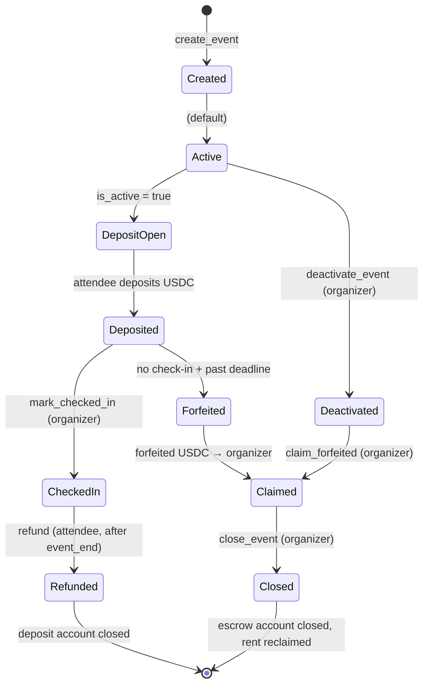
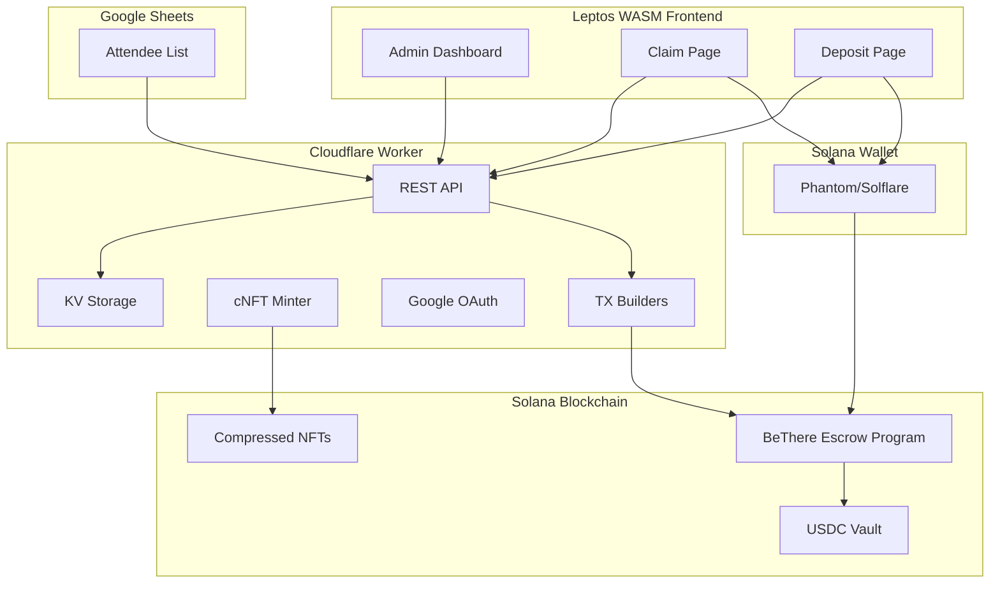
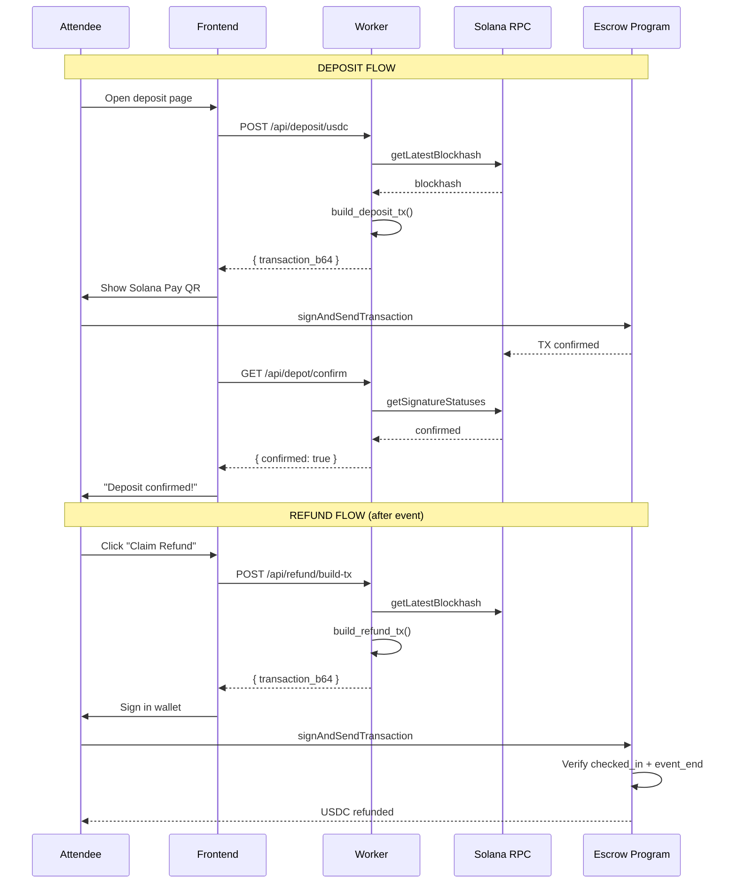

# BeThere — Presentation Materials

> Architecture diagrams, user flows, and sponsor-ready one-pager for the BeThere event check-in platform.

---

## 1. Platform Overview

### What is BeThere?

BeThere is a **Solana-powered event check-in platform** that combines:
- 📋 **Google Sheets–driven attendee management** — organizers manage their guest list in a familiar spreadsheet
- 📱 **QR-based check-in** — staff scan attendee QR codes at the door
- 🎫 **cNFT attendance badges** — compressed NFTs minted on Solana as proof-of-attendance
- 💰 **USDC deposit/escrow** — attendees commit USDC to secure their spot, get it back after check-in
- 🧩 **Quiz & Adventure gating** — attendees complete challenges before claiming their NFT
- 🌐 **Cloudflare Workers backend** — globally distributed, serverless, edge-deployed

### Key Metrics

| Metric | Value |
|--------|-------|
| On-chain program size | 63 KB (optimized) |
| Check-in latency | < 500ms (edge worker) |
| NFT mint cost | ~$0.001 per badge (cNFT) |
| Platform stack | Rust + Solana + Cloudflare Workers + Leptos WASM |
| Program ID | `2TGfNNXNez2NgopffDnYYhLNYmndUBBwg5SvpD5XQeLo` |
| Test coverage | 61 tests (39 worker + 22 on-chain) |

---

## 2. System Architecture

### High-Level Architecture

```
┌─────────────────────────────────────────────────────────┐
│                    Attendee Browser                       │
│  ┌───────────┐  ┌──────────┐  ┌──────────────────────┐ │
│  │ Claim Page │  │ Deposit  │  │  Solana Wallet       │ │
│  │ + Quiz    │  │ + Pay    │  │  (Phantom/Solflare)  │ │
│  └─────┬─────┘  └────┬─────┘  └──────────┬───────────┘ │
└────────┼──────────────┼───────────────────┼──────────────┘
         │              │                   │
         ▼              ▼                   │
┌─────────────────────────────────┐         │
│   Cloudflare Worker (Edge)      │         │
│  ┌──────────┐  ┌─────────────┐ │         │
│  │ REST API │  │ TX Builders │ │         │
│  │ + Auth   │  │ (deposit,   │ │         │
│  │ + Sheets │  │  refund,    │ │─────────┘ (TX sent
│  │ + KV     │  │  escrow)    │ │           to wallet
│  └──────────┘  └─────────────┘ │           for signing)
│  ┌──────────┐  ┌─────────────┐ │
│  │ NFT Mint │  │ Cron        │ │
│  │ (Helius) │  │ Cleanup     │ │
│  └──────────┘  └─────────────┘ │
└────────────┬───────────────────┘
             │                    ┌─────────────────────┐
             │                    │  Solana (Devnet /    │
             ├────────────────────▶  Mainnet)            │
             │                    │  ┌────────────────┐ │
             │                    │  │ BeThere Escrow │ │
             │                    │  │ Program        │ │
             │                    │  └────────────────┘ │
             │                    └─────────────────────┘
             ▼
┌──────────────────────┐
│  Google Sheets API   │
│  (attendee source)   │
└──────────────────────┘
```

### Component Details

| Component | Technology | Purpose |
|-----------|-----------|---------|
| **Frontend** | Leptos 0.7 (Rust → WASM) | Admin dashboard, attendee claim page, deposit flow |
| **Worker** | Cloudflare Workers (Rust → WASM) | API server, TX builders, auth, NFT minting |
| **Storage** | Cloudflare KV | Event configs, quiz state, deposit tracking |
| **On-chain** | Quasar (Solana SVM) | Escrow program — deposit, refund, claim, close |
| **NFT** | Helius cNFT API | Compressed NFT minting for attendance badges |
| **Wallet** | Wallet Standard JS | Phantom, Solflare, Backpack, Coinbase Wallet |

---

## 3. Escrow Architecture (Detailed)

### Account Structure

```
EventEscrow PDA ["escrow", event_id]
├── organizer:      Pubkey    (who created it)
├── usdc_mint:      Pubkey    (USDC mint address)
├── vault:          Pubkey    (ATA holding deposited USDC)
├── deposit_amount: u64       (lamports per attendee)
├── event_end:      i64       (unix timestamp)
├── refund_deadline: i64      (unix timestamp)
├── total_deposited:  u64     (running counter)
├── total_refunded:   u64     (running counter)
├── total_forfeited:  u64     (running counter)
├── is_active:       bool     (false after deactivation)
└── bump:            u8       (PDA bump seed)

AttendeeDeposit PDA ["deposit", event_escrow, attendee]
├── attendee:     Pubkey
├── event:        Pubkey
├── amount:       u64
├── deposited_at: i64
├── checked_in:   bool       (set by organizer at door)
├── refunded:     bool
└── bump:         u8
```

### Instruction Flow

```
┌──────────────┐     ┌──────────────┐     ┌────────────────┐
│  ORGANIZER   │     │  ATTENDEE    │     │  ON-CHAIN      │
└──────┬───────┘     └──────┬───────┘     └───────┬────────┘
       │                    │                     │
       │  create_event      │                     │
       ├──────────────────────────────────────────▶│
       │                    │                     │ EventEscrow PDA
       │                    │                     │ + Vault ATA created
       │                    │                     │
       │                    │  deposit (USDC)     │
       │                    ├────────────────────▶│
       │                    │                     │ USDC → Vault
       │                    │                     │ AttendeeDeposit PDA
       │                    │                     │
       │  mark_checked_in   │                     │
       ├──────────────────────────────────────────▶│
       │                    │                     │ checked_in = true
       │                    │                     │
       │                    │  refund (after      │
       │                    │  event end +        │
       │                    │  check-in)          │
       │                    ├────────────────────▶│
       │                    │                     │ USDC → Attendee ATA
       │                    │                     │ AttendeeDeposit closed
       │                    │                     │
       │  deactivate_event  │                     │
       ├──────────────────────────────────────────▶│
       │                    │                     │ is_active = false
       │                    │                     │
       │  claim_forfeited   │                     │
       │  (after refund     │                     │
       │   deadline)        │                     │
       ├──────────────────────────────────────────▶│
       │                    │                     │ All remaining USDC
       │                    │                     │ → Organizer ATA
       │                    │                     │
       │  close_event       │                     │
       ├──────────────────────────────────────────▶│
       │                    │                     │ EventEscrow closed
       │                    │                     │ Rent reclaimed
```

### Security Model

| Instruction | Signer Required | Constraints |
|-------------|----------------|-------------|
| `create_event` | Organizer | Valid event_id, valid USDC mint |
| `deposit` | Attendee | `is_active == true`, correct amount, ATA exists |
| `mark_checked_in` | Organizer (authority) | `has_one organizer`, deposit exists for attendee |
| `refund` | Attendee | `checked_in == true`, `now > event_end`, not already refunded |
| `claim_forfeited` | Organizer | `now > refund_deadline`, `has_one organizer` |
| `close_event` | Organizer | `has_one organizer`, all deposits settled |
| `deactivate_event` | Organizer | `has_one organizer` |

---

## 4. User Stories

### Organizer Journey

> **"I want to run a Solana event with guaranteed attendance"**

1. **Create event** in BeThere admin dashboard — connect Google Sheet with guest list
2. **Enable deposits** — set USDC amount per attendee (e.g., $5 commitment)
3. **Initialize escrow** — connect Phantom wallet → two clicks (create vault + init escrow)
4. **Share registration link** — attendees register and deposit USDC via Solana Pay QR
5. **Event day** — staff scan QR codes → automatic check-in → `mark_checked_in` on-chain
6. **After event** — attendees claim USDC refund + attendance NFT badge
7. **No-shows forfeit** — organizer claims unclaimed deposits after refund deadline
8. **Close escrow** — reclaim rent SOL, event complete

### Attendee Journey

> **"I want to attend an event and get my deposit back"**

1. **Register** — fill form, get QR code
2. **Deposit** — scan Solana Pay QR or connect wallet → approve USDC transfer
3. **Show up** — staff scans QR at the door → checked in
4. **Claim** — open claim link → complete quiz/adventure → mint attendance NFT
5. **Refund** — USDC automatically returned after check-in + event end
6. **Walk away** with: attendance NFT in wallet + full USDC refund

### No-Show Journey

> **"I registered but didn't show up"**

1. Register + deposit USDC
2. Don't attend → not checked in
3. After refund deadline → deposit forfeited to organizer
4. No NFT badge, no refund

---

## 5. Payment Flows

### USDC Deposit Flow

```
Attendee                    BeThere Worker                Solana
   │                             │                          │
   │  "I want to deposit"        │                          │
   ├────────────────────────────▶│                          │
   │                             │  build_deposit_tx()      │
   │                             ├─────────────────────────▶│
   │                             │  ◀── base64 TX           │
   │  ◀── Solana Pay QR / TX    │                          │
   │                             │                          │
   │  sign + send TX             │                          │
   ├──────────────────────────────────────────────────────▶│
   │                             │                          │
   │                             │  verify_tx_on_chain()    │
   │                             ├─────────────────────────▶│
   │                             │  ◀── confirmed           │
   │  ◀── "Deposit confirmed!"  │                          │
```

### THB PromptPay Flow (Alternative)

```
Attendee                    BeThere Worker              Organizer
   │                             │                          │
   │  Upload payment slip        │                          │
   ├────────────────────────────▶│                          │
   │                             │  Store slip in KV        │
   │                             │  ────────────────▶       │
   │                             │                          │
   │                             │  Admin sees pending slip │
   │                             │  ◀────────────────       │
   │                             │                          │
   │                             │  Verify/Reject           │
   │                             │  ────────────────▶       │
   │                             │                          │
   │  ◀── "Deposit verified"    │                          │
```

---

## 6. Technical Deep Dive

### Why This Stack?

| Choice | Reason |
|--------|--------|
| **Rust everywhere** | Shared types between on-chain + worker + frontend. Zero serialization bugs. |
| **Cloudflare Workers** | Edge deployment (< 50ms globally), no server management, KV included. |
| **Leptos WASM** | Full React-like SPA in Rust. WASM binary cached after first load. |
| **Quasar (Solana)** | Zero-copy accounts (60% smaller), built-in CPI helpers, no Anchor overhead. |
| **cNFT (Helius)** | $0.001 per NFT vs $0.02 regular. Merkle tree compression. |
| **USDC (not SOL)** | Stable value for deposits. Attendees know exact refund amount. |

### Performance Profile

| Operation | Latency | Cost |
|-----------|---------|------|
| Check-in (scan QR) | < 500ms | Free (off-chain) |
| NFT claim (mint) | ~2s | ~$0.001 |
| USDC deposit | ~3s (wallet + confirm) | ~$0.00025 (tx fee) |
| USDC refund | ~3s | ~$0.00025 (tx fee) |
| Program deployment | One-time | ~1.5 SOL net |
| Escrow init per event | ~3s | ~0.002 SOL (rent) |

### Security Audit Summary

24 findings identified and fixed across:
- Input validation (pubkey parsing, amount bounds, timestamp checks)
- Account validation (organizer authority, PDA seed verification)
- TX building (account ordering, discriminator correctness)
- Edge cases (double deposit prevention, idempotent operations, replay protection)

---

## 7. One-Page Sponsor Deck

---

# **BeThere**
### *Solana-Powered Event Check-In Platform*

**Turn every event into an on-chain experience.**

---

**The Problem**
- Events have 30-40% no-show rates for free events
- No easy way to give attendees on-chain proof of attendance
- Existing tools are Web2-only, no crypto integration

**The Solution — BeThere**

A complete event management platform that:
1. ✅ **Guarantees attendance** — USDC deposit commitment, refunded after check-in
2. 🎫 **Rewards attendees** — Compressed NFT badges as proof-of-attendance
3. 🎮 **Engages attendees** — Quiz and adventure challenges to claim rewards
4. 🌐 **Runs on Solana** — Fast, cheap, globally accessible

**How It Works (3 Steps)**

| Step | For Attendee | For Organizer |
|------|-------------|---------------|
| **1. Register** | Deposit $5 USDC to secure spot | Set deposit amount, share link |
| **2. Show Up** | Scan QR at door, get checked in | Staff scans with phone |
| **3. Claim** | Get refund + NFT badge | Claim no-show deposits |

**Tech Stack**
```
Rust + Solana + Cloudflare Workers + WASM
```
- **63 KB on-chain program** — minimal footprint
- **Edge-deployed globally** — < 500ms check-in
- **$0.001 NFT minting** — compressed NFTs on Solana
- **100% Rust codebase** — shared types, zero serialization bugs

**Traction**
- Originated from manual deposit/refund events — now automated on-chain
- End-to-end tested on devnet (61 tests passing)
- Ready for mainnet deployment (1.5 SOL cost)
- Supports both USDC (on-chain) and PromptPay THB (fiat) deposits

**What We're Looking For**
- 🚀 **Mainnet deployment funding** (~$300 for program deployment + initial operations)
- 🤝 **Event partnerships** — run your next Solana event on BeThere
- 💡 **Feedback & pilots** — we'll set up your event for free

**Contact:** [Your info here]

---

*Built with ❤️ by the BeThere team*

---

## 8. Mermaid Diagrams

### Full Escrow Lifecycle



### Platform Data Flow



### Deposit → Refund Sequence



---

## 9. Competitive Landscape

| Feature | BeThere | Luma | Eventbrite | POAP |
|---------|---------|------|------------|------|
| On-chain deposits | ✅ USDC escrow | ❌ | ❌ | ❌ |
| Attendance NFTs | ✅ cNFT (Solana) | ❌ | ❌ | ✅ (Ethereum) |
| Deposit refund | ✅ Automatic | ❌ | Manual | ❌ |
| No-show penalty | ✅ Forfeit to org | ❌ | ❌ | ❌ |
| Quiz/Adventure gating | ✅ Built-in | ❌ | ❌ | ❌ |
| Cost per NFT | ~$0.001 | N/A | N/A | ~$0.50 |
| Self-serve setup | ✅ Google Sheets | ✅ | ✅ | Partial |
| Open source | ✅ | ❌ | ❌ | ❌ |

---

## 10. Roadmap

| Phase | Status | Description |
|-------|--------|-------------|
| **Phase 1** | ✅ Done | Core check-in + NFT minting |
| **Phase 2** | ✅ Done | Multi-event management |
| **Phase 3** | ✅ Done | Quiz + adventure gating |
| **Phase 4** | ✅ Done | USDC deposit escrow |
| **Phase 5** | 🟡 In Progress | Mainnet deployment |
| **Phase 6** | 📋 Planned | Platform fees (1-2% on forfeited deposits) |
| **Phase 7** | 📋 Planned | Multi-organizer SaaS |
| **Phase 8** | 📋 Planned | Mobile app (React Native) |

---
