# BeThere — Solana Protocol Architecture Diagram

> Deposit-backed event check-in platform on Solana.
> Program ID: `C6HDeZES9aPpNwe3UvS9ecmfcRhH1XeJb8PGJmLG3z3T`
>
> **Companion document:** [Protocol POC Requirements](protocol_poc_requirements.md) — formal "shall" requirements for every instruction and account.

---

## 1. System Overview — High-Level Architecture

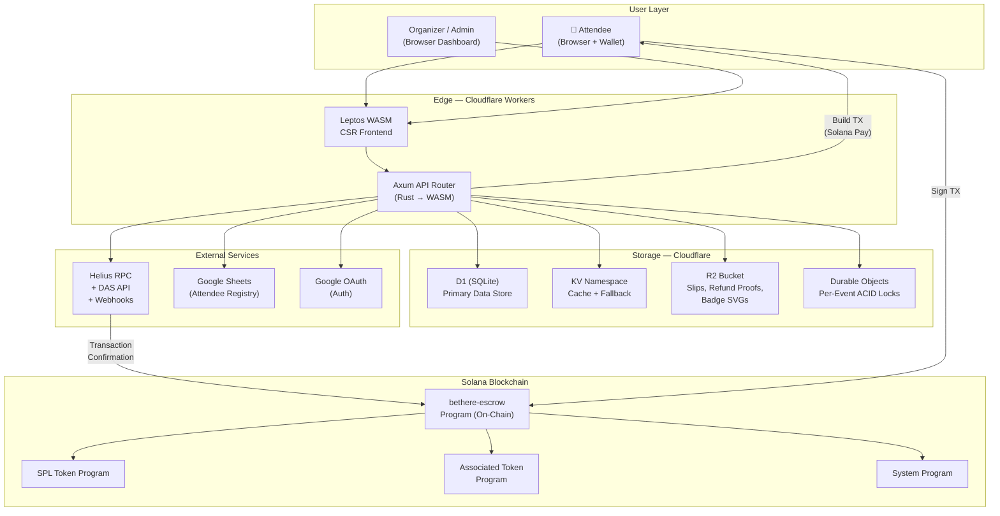

---

## 2. On-Chain Program — Account Structure

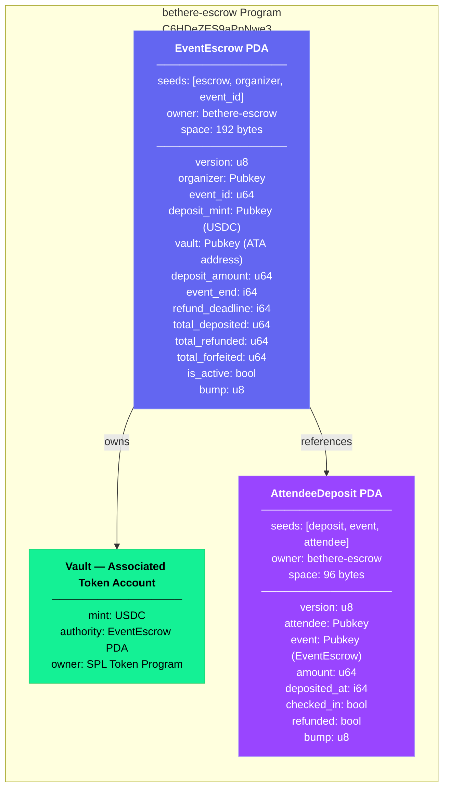

---

## 3. Program Instructions — Lifecycle Flow

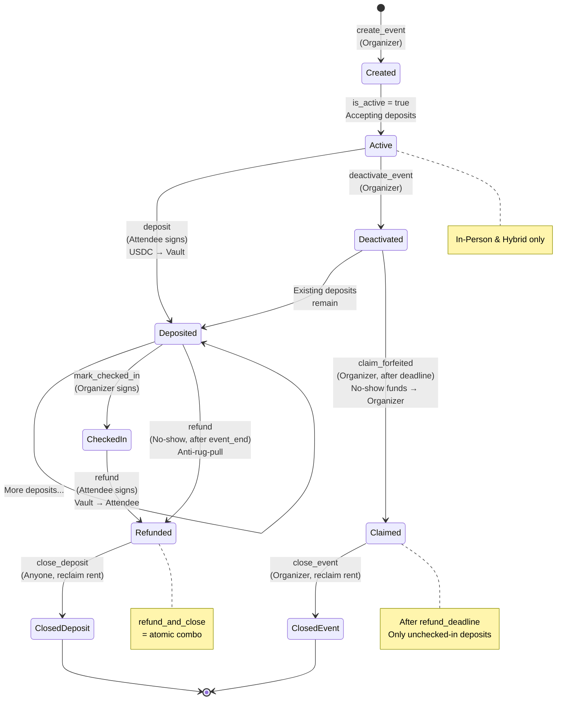

---

## 4. In-Person Attendee Flow — Full Sequence

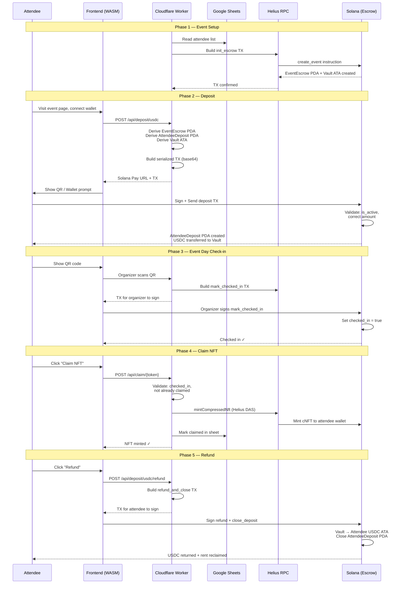

---

## 5. Online Attendee Flow — Quest-Based Verification

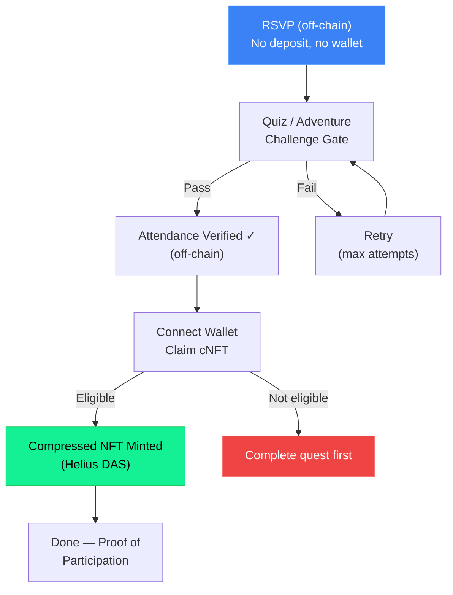

---

## 6. Event Format — Decision Matrix

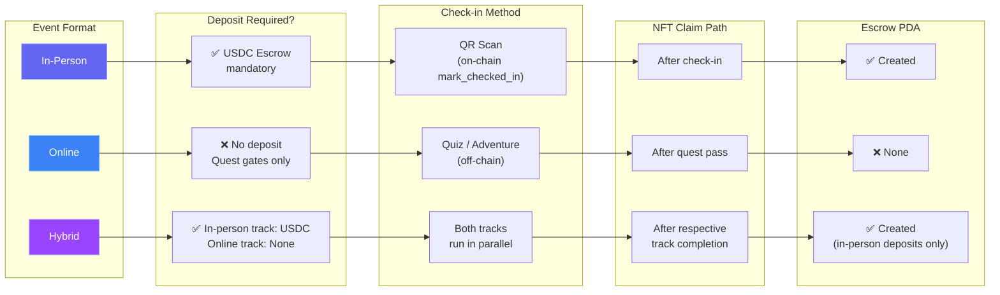

---

## 7. Escrow Indexer — On-Chain Event Sync

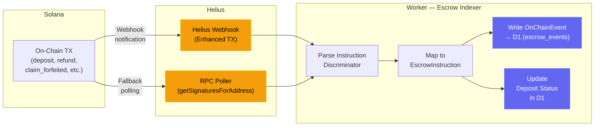

---

## 8. Worker Module Architecture — Hexagonal Layers

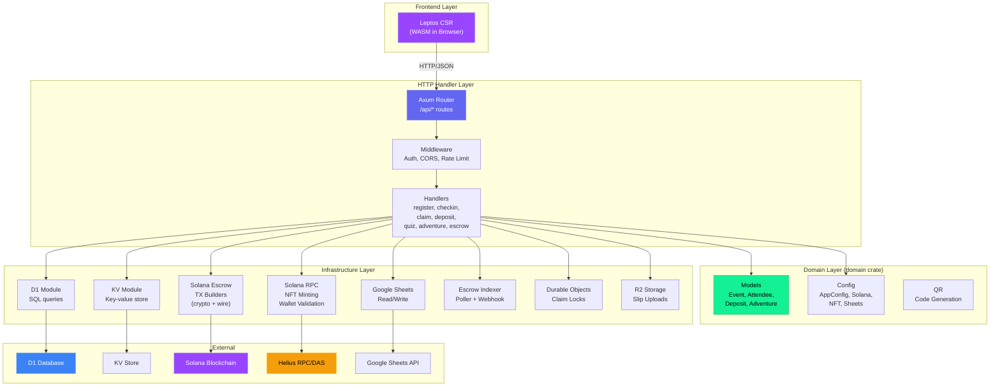

---

## 9. PDA Derivation — Seed Hierarchy

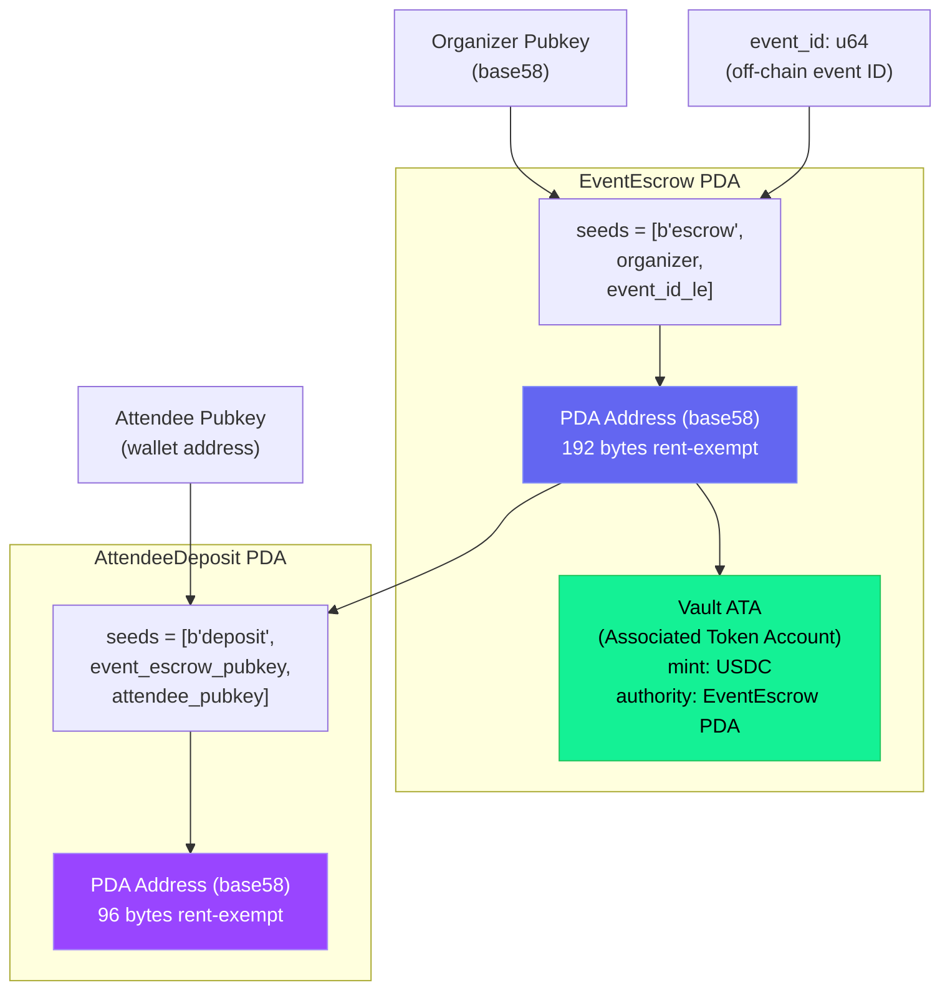

---

## 10. Security Model — Trust Boundaries

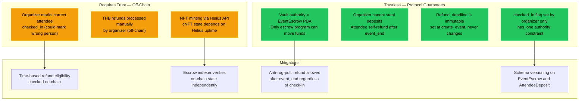

---

## 11. Dual-Track Payment — USDC vs THB

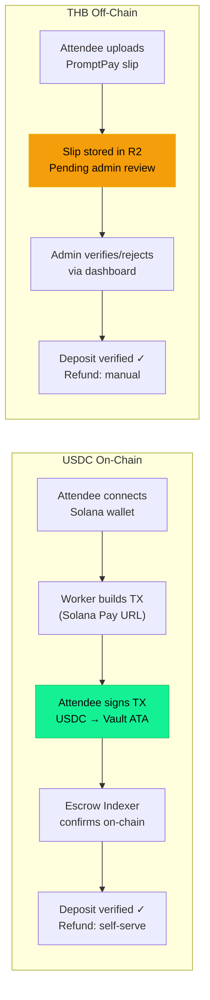

---

## 12. Instruction Interaction Matrix — CPI & Data Flow

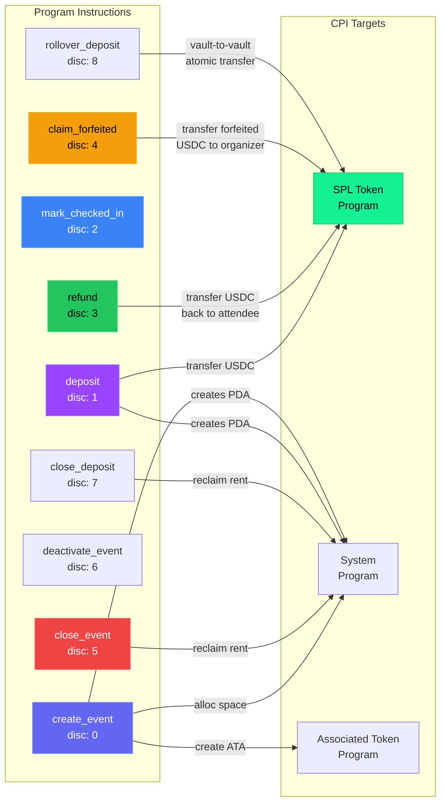

---

## 13. Deployment & Infrastructure Topology

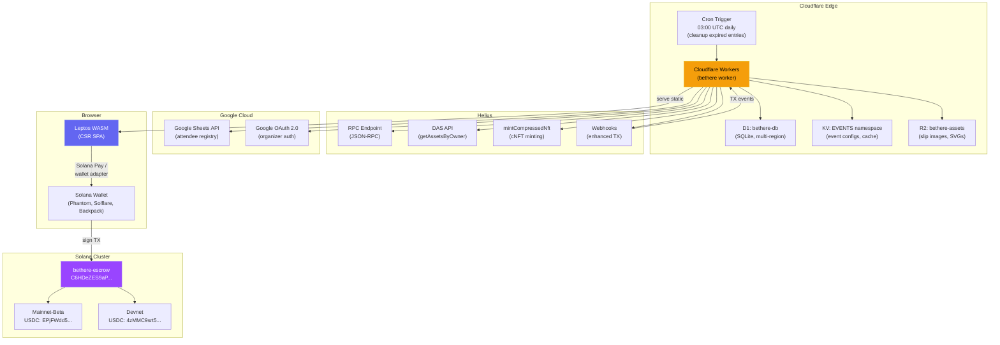

---

## 14. API Surface — Worker Endpoints

| Category | Endpoint | Method | Auth | Description |
|---|---|---|---|---|
| **Event** | `/api/events` | GET | — | List public events |
| | `/api/events/{id}` | GET | — | Event detail |
| | `/api/events` | POST | Admin | Create event |
| | `/api/events/{id}` | PUT | Admin | Update event config |
| **Registration** | `/api/register` | POST | — | RSVP for event |
| | `/api/attendee/{id}` | GET | — | Attendee lookup |
| **Deposit (USDC)** | `/api/deposit/usdc` | POST | — | Build Solana Pay deposit TX |
| | `/api/deposit/status/{id}` | GET | — | Deposit status lookup |
| | `/api/deposit/usdc/refund` | POST | — | Build refund TX |
| | `/api/deposit/usdc/refund-and-close` | POST | — | Atomic refund + close |
| **Deposit (THB)** | `/api/deposit/thb/upload` | POST | — | Upload payment slip |
| | `/api/deposit/thb/pending` | GET | Admin | List pending slips |
| | `/api/deposit/thb/verify` | POST | Admin | Approve/reject slip |
| | `/api/refund/mark/{id}` | POST | Admin | Mark THB refund done |
| **Escrow** | `/api/escrow/init` | POST | Admin | Build init_escrow TX |
| | `/api/escrow/deactivate` | POST | Admin | Build deactivate TX |
| | `/api/escrow/close` | POST | Admin | Build close_event TX |
| | `/api/escrow/claim` | POST | Admin | Build claim_forfeited TX |
| | `/api/escrow/rollover` | POST | Admin | Build rollover_deposit TX |
| | `/api/escrow/index` | GET | Admin | On-chain event log |
| **Check-in** | `/api/checkin` | POST | Staff | QR code check-in |
| | `/api/walkin` | POST | Staff | Walk-in registration |
| **Claim** | `/api/claim/{token}` | GET | — | Claim status lookup |
| | `/api/claim/{token}` | POST | — | Mint cNFT to wallet |
| **Quiz** | `/api/quiz/questions` | GET | — | Get quiz questions |
| | `/api/quiz/submit` | POST | — | Submit quiz answers |
| **Adventure** | `/api/adventure/config` | GET | — | Get adventure config |
| | `/api/adventure/submit` | POST | — | Submit level answer |
| **Auth** | `/api/auth/login` | GET | — | Google OAuth redirect |
| | `/api/auth/callback` | GET | — | OAuth callback |
| | `/api/auth/me` | GET | JWT | Current user info |
| **Webhook** | `/api/webhook/escrow` | POST | Bearer | Helius escrow events |

---

## 15. Error Codes — On-Chain Program

| Code | Name | Description |
|---|---|---|
| 0 | `IncorrectDepositAmount` | Deposit ≠ escrow.deposit_amount |
| 1 | `RefundNotYetAllowed` | event_end not reached |
| 2 | `NotCheckedIn` | Attendee not checked in (legacy) |
| 3 | `RefundDeadlineNotPassed` | Organizer cannot claim yet |
| 4 | `AlreadyRefunded` | Double refund prevented |
| 5 | `AttendeeCheckedIn` | Checked-in deposit cannot be forfeited |
| 6 | `NoForfeitedFunds` | Nothing to claim |
| 7 | `EventNotActive` | Deposits rejected |
| 8 | `EventStillActive` | Cannot close active event |
| 9 | `Unauthorized` | Wrong signer |
| 10 | `VaultMismatch` | Wrong vault account |
| 11 | `MintMismatch` | Wrong USDC mint |
| 12 | `InvalidDepositAmount` | deposit_amount = 0 |
| 13 | `EventEndInPast` | event_end must be future |
| 14 | `Overflow` | Arithmetic overflow |
| 15 | `VaultNotEmpty` | Settle first |
| 16 | `EventEnded` | No check-ins after event |
| 17 | `DepositNotRefunded` | Cannot close unrefunded deposit |
| 18 | `EventEscrowStillActive` | Close deposits first |
| 19 | `RefundDeadlinePassed` | No-show forfeiture window |
| 20 | `EscrowVersionMismatch` | Unsupported schema |
| 21 | `DepositVersionMismatch` | Unsupported schema |
| 22 | `RefundRequiresClose` | refund must pair with close_deposit |

---

## Legend

| Symbol | Meaning |
|---|---|
| 🟣 Purple boxes | Solana on-chain components |
| 🟢 Green boxes | Token / value transfer |
| 🔵 Blue boxes | Off-chain infrastructure |
| 🟡 Yellow boxes | External services / trust-required |
| 🔴 Red boxes | Terminal / error states |
| → Solid arrows | Direct call / data flow |
| ⇢ Dashed arrows | Async / webhook notification |

---

## Evaluation Checklist

| Criterion | Status |
|---|---|
| All programs represented | ✅ bethere-escrow (9 instructions) |
| Account structures mapped | ✅ EventEscrow, AttendeeDeposit, Vault ATA |
| Program interactions illustrated | ✅ CPI to SPL Token, System, Associated Token |
| External dependencies shown | ✅ Helius, Google Sheets, OAuth, D1, KV, R2 |
| Decision points and alternate flows | ✅ In-Person vs Online vs Hybrid; USDC vs THB |
| Instruction ordering constraints | ✅ Lifecycle state diagram |
| Security model documented | ✅ Trustless vs trust-required |
| Clear, consistent labeling | ✅ Color-coded legend |
