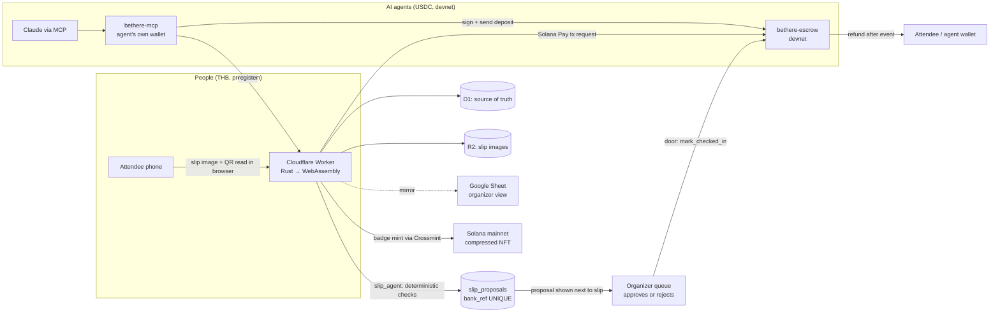

# BeThere on one page

One commitment layer, two ways in: **people pay in baht** (checked by the slip
agent) and **agents pay in USDC on Solana** (settled by the escrow program).
Everyone who shows up gets their deposit back and a badge on mainnet.

## The three flows judged in this window

| Flow | What decides | Where | Evidence |
|---|---|---|---|
| **Slip check (AI proposes, checks dispose)** | Deterministic rules: reference never seen (DB `UNIQUE`), amount, time window, receiver. The organizer makes the final call | prod, shadow mode | `worker/src/handlers/deposit/thb/handlers/slip_agent.rs`, migration `0054` |
| **Escrow loop** | The Solana program: `deposit` → `mark_checked_in` → `refund`; `claim_forfeited` refuses checked-in attendees | devnet | `bethere-escrow/src/lib.rs`, `scripts/e2e_devnet_test.sh` (green 27 Sep) |
| **Agent commits for a human** | The escrow again; the agent only signs with its own key, within an operator spend cap | staging + devnet | `bethere-mcp/`, Claude run tx `v9H1A84w…` |

## Design rules that hold across all three

- **No model output moves money.** The slip agent writes proposals only;
  guards live in `worker/tests/slip_duplicate_guards.rs`.
- **D1 is the source of truth.** The Google Sheet is a mirror, and a failed
  mirror write never blocks a money action (`.issues/155`).
- **One `domain` crate** is shared by the worker (wasm), the frontend (wasm)
  and the native tools, so the slip QR is parsed by the same code in the
  browser and on the server.
- **0 THB running cost target.** It runs on the Cloudflare free plan. The
  paid vision model is off; the planned OCR runs in the browser.
